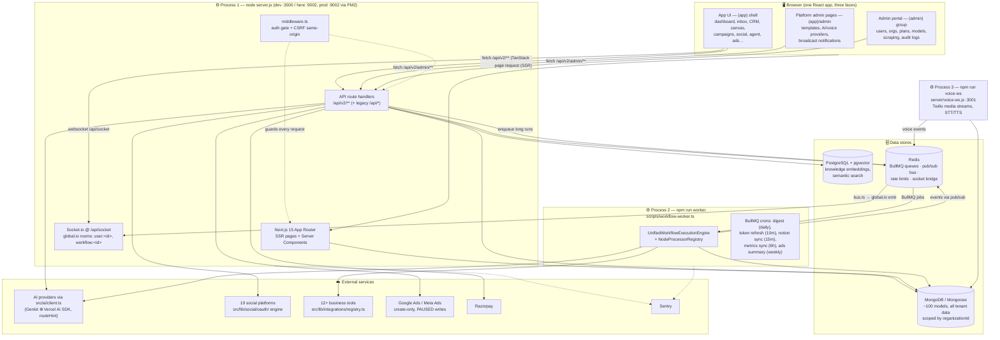
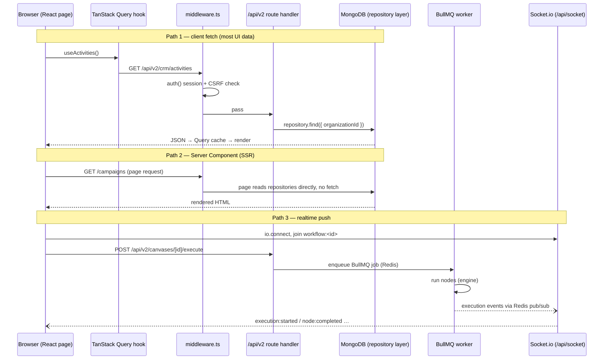
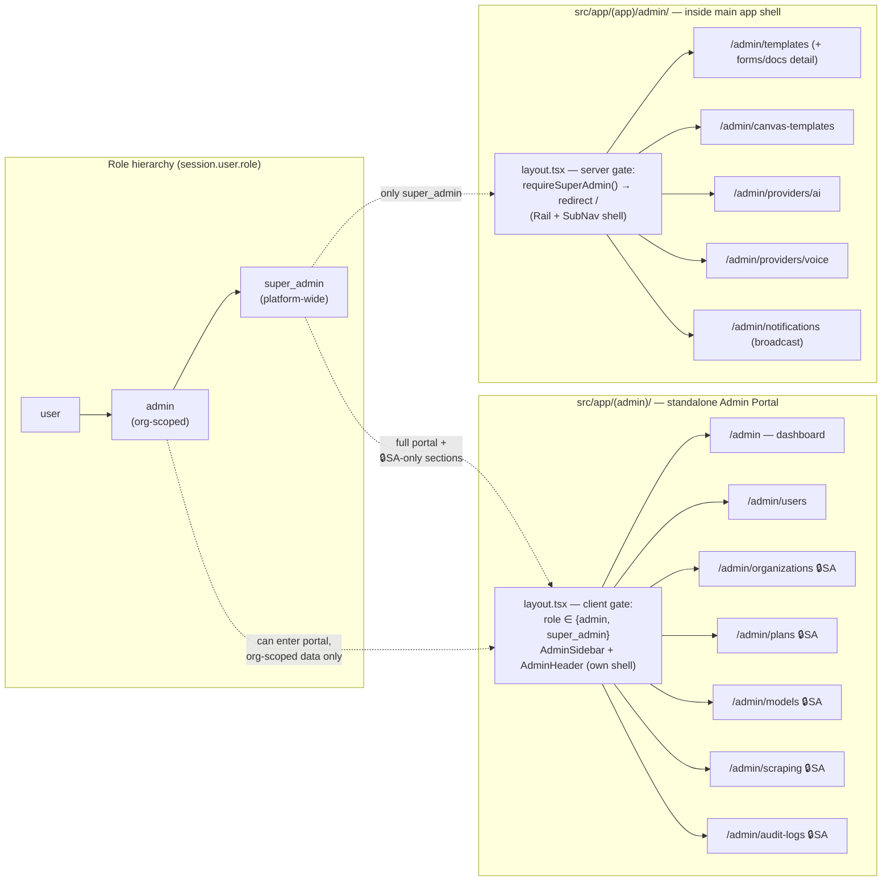
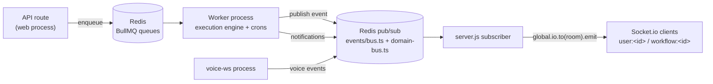

# System Architecture — High-Level Map

> Scope: One-page visual map of how the frontend, backend, admin panel, super-admin panel, background processes, and data stores connect.
> Rendering context: Mermaid diagrams — render natively in Obsidian, GitHub, and VS Code.
> Last updated: 2026-06-05

## TL;DR

MontrAI is **not** a separate-frontend/separate-backend system. It is a single Next.js 15 monolith served by a custom Node server (`server.js`), where:

- The **frontend** is the App Router page tree (`src/app/`), composed from the ui-kit.
- The **backend** is the API route handlers (`src/app/api/v2/**`) + Server Components + Socket.io, living in the *same process and same repo*.
- Frontend and backend are connected by **three concrete transport paths** (fetch via TanStack Query, direct DB access in Server Components, Socket.io websocket) — evidence below.
- Two extra OS processes exist: the **BullMQ worker** and the **voice websocket server**, glued to the web process via Redis.

---

## 1. Big Picture — processes, stores, externals

**Key takeaway:** there is no network boundary between "frontend" and "backend" deployments — they are one Next.js app. The real process boundaries are **web ⇄ worker ⇄ voice-ws**, and Redis is the glue between them.

---

## 2. Is the frontend *really* connected to the backend? — Yes, three ways

Concrete, verified wiring (hook file → HTTP endpoint → route handler file):

| # | Path | Frontend side | Transport | Backend side |
|---|------|--------------|-----------|--------------|
| 1 | **Client fetch** | `src/hooks/crm/use-activities.ts` (TanStack Query) | `fetch('/api/v2/crm/activities')` | `src/app/api/v2/crm/activities/route.ts` |
| 1 | | `src/hooks/use-admin.ts` → `useAdminStats` / `useAdminUsers` / `useAdminPlans` | `fetch('/api/v2/admin/stats' \| '/users' \| '/plans')` | `src/app/api/v2/admin/*/route.ts` |
| 2 | **Server Components** | `src/app/(app)/admin/layout.tsx` | none — same process | `requireSuperAdmin()` in `src/middleware/auth.ts` queries Mongoose directly |
| 3 | **Realtime** | `src/hooks/use-socket.ts` → `io({ path: '/api/socket' })` | websocket | `server.js` Socket.io server; events pushed via `global.io` and Redis bus (`src/lib/workflow/events/bus.ts`) |

---

## 3. Admin vs Super-Admin — two surfaces, one URL namespace

Both live under `/admin/*` but on **disjoint sub-paths**, wrapped by different shells, with different gates:

Enforcement is **layered** — UI gates are convenience, the real walls are server-side:

| Layer | Where | What it checks |
|-------|-------|----------------|
| Route middleware | `middleware.ts` | authenticated session, CSRF same-origin on mutations |
| Layout (portal) | `src/app/(admin)/layout.tsx` | client-side `useSession()` role ∈ {admin, super_admin} |
| Layout (app-admin) | `src/app/(app)/admin/layout.tsx` → `src/middleware/auth.ts` | server-side `requireSuperAdmin()`, redirect to `/` |
| **API routes** (the wall) | `src/app/api/v2/admin/**` — per-route `getAdminUser()` | role check **plus** super-admin email allowlist (`src/lib/auth/super-admin.ts`); `admin` gets org-scoped results, `super_admin` gets global |
| UI flags | `src/hooks/use-admin.ts` → `isAdmin` / `isSuperAdmin` | conditional rendering only — not security |

> ⚠️ The two layouts gate differently on purpose: the portal admits org-`admin` (sees only their org's users/stats), while the in-app `/admin/templates|providers|notifications` pages are platform-operator tools and demand `super_admin` outright.

---

## 4. Cross-process event flow (why Redis matters)

Without Redis the system degrades hard: BullMQ jobs don't run, the auth rate limiter **fails closed** (login breaks — see ops memory), and cross-process realtime stops. Redis is a hard runtime dependency, not a cache.

---

## 5. Where things live (orientation map)

| Concern | Path |
|---------|------|
| Frontend pages | `src/app/(app)/**`, `src/app/(admin)/**` |
| UI library (compose everything from here) | `src/components/ui-kit/` (`REGISTRY.md`) |
| App shell | `src/components/shell/` (Rail, SubNav, ModuleShell) |
| Backend API | `src/app/api/v2/**` |
| Data access | `src/lib/db/models/` + `src/lib/db/repository/` |
| Auth/session | `auth.ts`, `middleware.ts`, `src/lib/auth/` |
| Workflow engine | `src/lib/workflow/` |
| AI gateway (only entry point to providers) | `src/ai/client.ts` |
| Worker entry | `scripts/workflow-worker.ts` |
| Voice WS entry | `server/voice-ws.js` |

## Related Docs

- [[overview]] — full doc index and architectural decisions
- [[data-flow]] — request/data lifecycle in detail
- [[auth-flow]] / [[authorization]] — session strategy, roles, tenancy enforcement
- [[route-handlers-part1]] / [[route-handlers-part2]] — every API route + auth requirement
- [[database]] — full model inventory
- [[deployment]] — PM2, ports, infra dependencies
